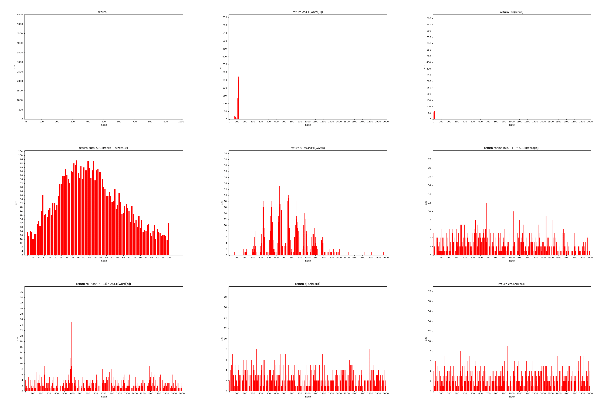

# Оптимизация хэш-таблиц при помощи низкоуровневого кода

## Задача

- Часть 1
    - написать хэш-таблицу для строк фиксированного размера и несколько хэш-функций для неё
    - выяснить, какая хэш-функция дает лучшее распределение
    - посмотреть, как транслируется код хэш-функций, использующих циклический сдвиг
- Часть 2
    - оптимизировать функции, которые больше всего влияют на время работы программы, использовать для этого три метода оптимизации
        - функции, написанные на ассемблере
        - ассемблерные вставки
        - SIMD инструкции
    - рассчитать КПД оптимизации по формуле: $\frac{коэффициент \ ускорения}{кол-во \ ассемблерных \ инструкций} * 1000$

## Ход работы

Реализована хэш-таблица на двусвязных списках, использующих три массива, общие для всех списков.

## Часть 1: Сравнение хэш-функций

<figure>

</figure>

### Исходники графиков
- [return 0](Images/charts/hash_func_1.png)
- [return int(word[0])](Images/charts/hash_func_2.png)
- [return  len(word)](Images/charts/hash_func_3.png)
- [return sum_ASCII(word) size=101](Images/charts/hash_func_4_101.png)
- [return sum_ASCII(word)](Images/charts/hash_func_4.png)
- [return ror(hash(n - 1)) * int(word[n])](Images/charts/hash_func_5.png)
- [return rol(hash(n - 1)) * int(word[n])](Images/charts/hash_func_6.png)
- [return djb2(word)](Images/charts/hash_func_7.png)
- [return crc32(word)](Images/charts/hash_func_8.png)

### Равномерность распределения

| Хэш-функция | Алгоритм | Дисперсия * 10<sup>2</sup>|
|:-----------:|:--------:|:---------:|
|   1   | return 0| 291.988|
|   2   | return int(word[0])  |7.228|
|   3   | return  len(word) |15.902|
|   4   | return sum_ASCII(word) | 0.207 |
|   5   | return ror(hash(n - 1)) * int(word[n])  | 0.034|
|   6   | return rol(hash(n - 1)) * int(word[n]) | 0.078|
|   7   | return djb2(word)  | 0.026 |
|   8   | return crc32(word) | 0.025 |

**Лучшее распределение оказалось у хэш-функции CRC32. В дальнейшем будем использовать ее. К тому же мы сможем оптимизировать её вычисление при помощи SIMD
инструкции.**

### Трансляция пятой и шестой хэш-функций

Компилятор `x86-64 gcc 13.2` на сайте https://godbolt.org/ транслирует код следующим образом

<table>
<tr>
<th>    </th>
<th> Используется sizeof(size_t) </th>
<th> Используется прямая подстановка числа </th>
</tr>
<tr>
<td> Исходный код </td>
<td>

```C
    return (num >> sizeof(size_t) - 1) | (num << 1)
```

</td>
<td>

```C
    return (num >> 63) | (num << 1)
```

</td>
</tr>
<tr>
<td> -O0 </td>
<td>

```assembly
    mov     rax, QWORD PTR [rbp-8]
    shr     rax, 7
    mov     rdx, rax
    mov     rax, QWORD PTR [rbp-8]
    add     rax, rax
    or      rax, rdx
```

</td>
<td>

```assembly
    mov     rax, QWORD PTR [rbp-8]
    rol     rax
```

</td>
</tr>
<tr>
<td> -O1 </td>
<td>

```assembly
    mov     rdx, rax
    shr     rdx, 7
    add     rax, rax
    or      rdx, rax
```

</td>
<td>

```assembly
    rol     rax
```

</td>
</tr>
</table>

**При использовании `sizeof(size_t)` компилятор использовал битовые сдвиги, а при прямой подстановке числа заменил мою функцию на ассемблерный циклический сдвиг, поэтому второй вариант лучше. При уровне оптимизации -O0 данные пересылаются из памяти, а при более высоком уровне оптимизации используются только регистры.**

## Часть 2: Что оптимизировать?

Первая очевидная оптимизация - использовать -O3 )))

При помощи утилиты `callgrind` определим, какие функции больше всего влияют на время работы хэш-таблицы. (Результаты профилирования [здесь](callgrind))

<figure>

</figure>

**Оказалось, что 30% времени занимает strcmp и столько же хэш-функция CRC32. Будем оптимизировать...**

### Оптимизируем

1)  Все слова из нашего текста оказались не длиннее 19 символов, а значить каждое из них влезет в 256 бит. Будем использовать в качестве ключей хэш-таблицы `union`.

```C
union Word {
    char str[32];
    __m256i packed;
};
```

    Теперь все слова выровнены и мы можем использовать для сравнения SIMD инструкцию `_mm256_cmpeq_epi8()`.

2) Для ускорения хэш-функции CRC32 будем использовать `_mm_crc32_u8()`.

### Результаты оптимизации

| Оптимизация | Время, c | Ускорение относительно -O0|Ускорение относительно -O3|
|:-----------:|:-----:|:------------------:|:----------------------------------:|
|  -O0        |2.673077|    1  | 0.6 |
| -O3         |1.663098|1.6 | 1 |
| -O3 + strcmp| 1.201393 | 2.2 | 1.4 |
| -O3 + strcmp + crc32| 1.054509 | 2.5 | 1.6 |