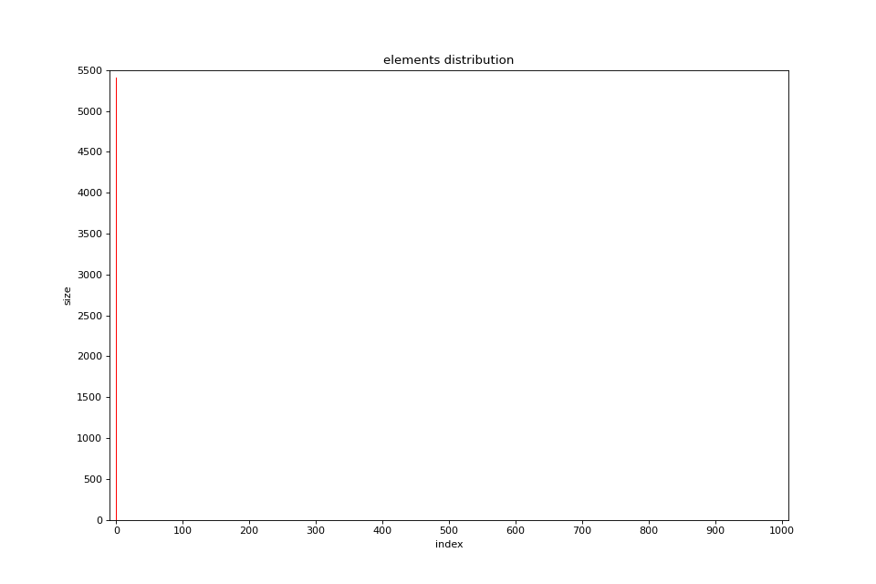
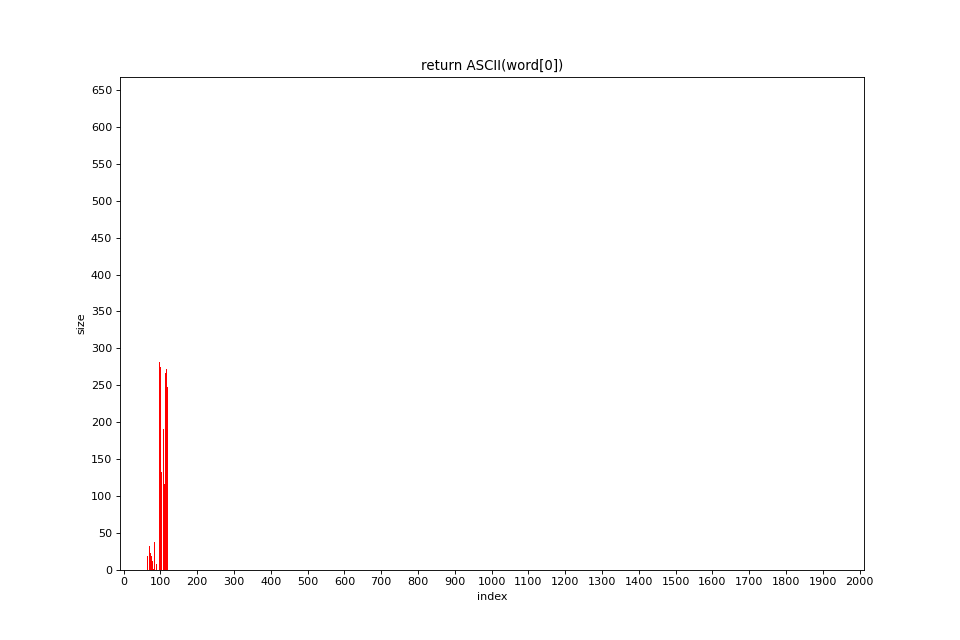
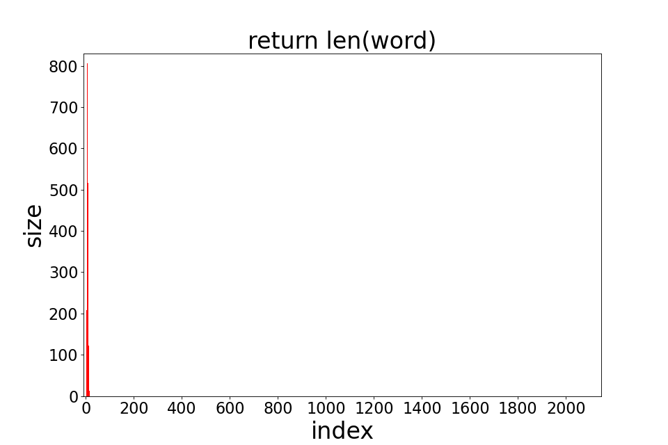
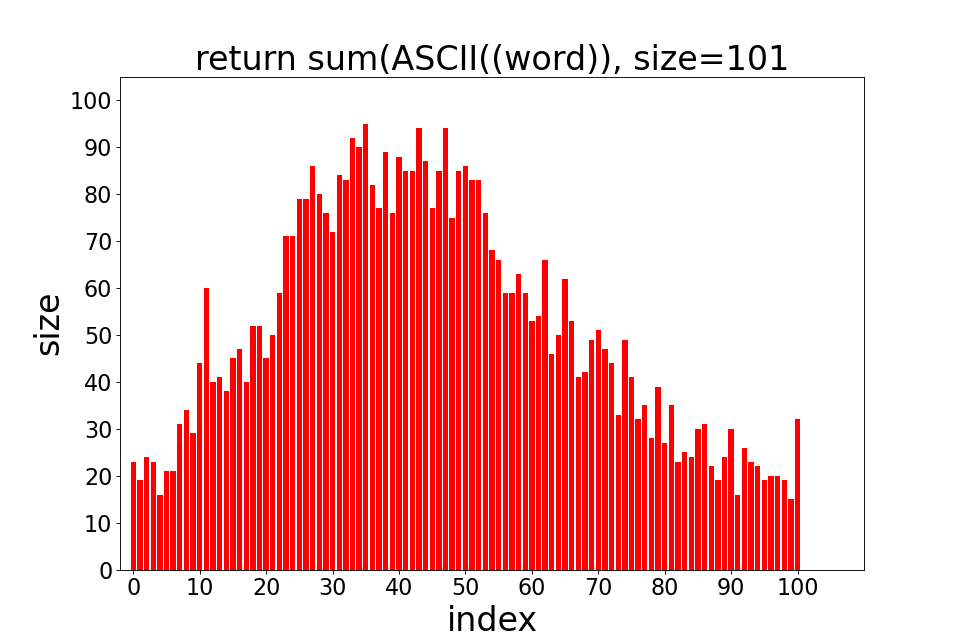
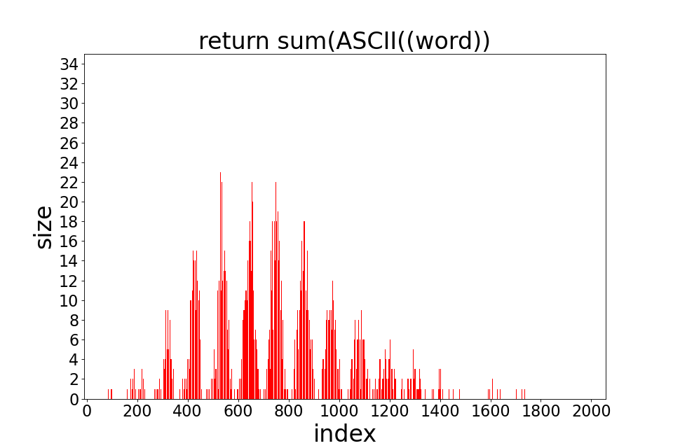
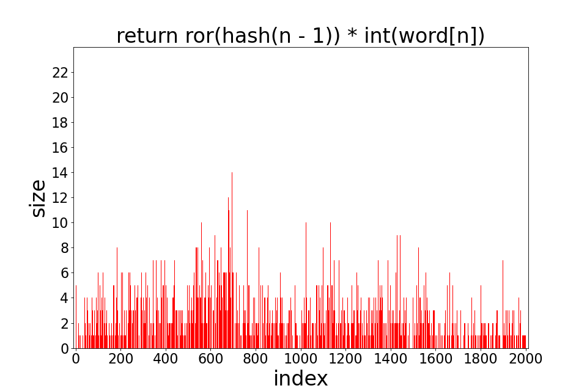
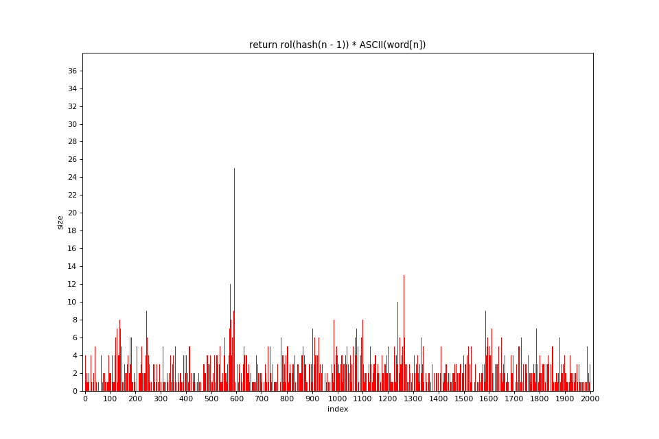

# Оптимизация хэш-таблиц при помощи ассемблерных инструкций

## Часть 1

## Задача

- Написать хэш-таблицу для строк фиксированного размера и 6 заданных хэш-функций для неё и одну свою:
- Преобразовать текст в набор слов без знаков пунктуации (кол-во слов не меньше 40 000)
- Поместить полученный набор слов в хэш-таблицу и построить диаграммы, отображающие длины цепочек в ячейках хэш-таблицы после вставки слов, для каждой хэш-функции
- выяснить, для какой хэш-функции количество коллизий наименьшее
- посмотреть как транслируется код 5 и 6 хэш-функций

## Ход работы

Реализована хеш-таблица на двусвязном списке на трех массивах, общих для всех списков. Размер таблицы - 2003
### Функции хэш-таблицы:
- вставка (если элемент уже есть есть в хэш-таблицы, повторная вставка не производится)

## Полученные результаты

### 1) Хэш-функция, всегда возвращающая 0

```C
size_t hashFuncZero(char *str, size_t size) {

    assert(str);

    return 0 % size;
}
```

<figure>

</figure>

**Все слова, как и ожидалось, попали в список под индексом 0.**

### 2) Хеш-функция, возвращающая ASCII код первого символа

```C
size_t hashFuncLetterASCII(char *str, size_t size) {

    assert(str);

    return (size_t) str[0] % size;
}
```

<figure>

</figure>

**Все слова находятся в диапазоне [0;255]**

### 3) Хэш-функция, возвращающая длину слова

```C
size_t hashFuncLength(char *str, size_t size) {

    assert(str);

    return strlen(str) % size;
}
```

<figure>

</figure>

**Большое количеств артиклей и коротких слов привело к большому числу коллизий**

### 4) Хеш-функция, возвращающая сумму ASCII кодов букв слова

```C
size_t hashFuncSumASCII(char *str, size_t size) {

    assert(str);

    size_t ascii_sum = 0;
    for (size_t i = 0; str[i] != '\0'; i++) {
        ascii_sum += (size_t) str[i];
    }

    return ascii_sum % size;
}
```

**Для таблицы размера 101**

<figure>

</figure>

**Для таблицы размера 2003**

<figure>

</figure>

**Распределение лучше, чем в предыдущих вариантах, но все равно не очень хорошее, особенно для таблицы размера 101**

### 5) Хеш-функция, которая делает циклический сдвиг вправо результата для подстроки размера на 1 меньше и применяет к нему xor с ASCII кодом текущего символа

```C
size_t hashFuncRor(char *str, size_t size) {

    assert(str);

    size_t hash = 0;
    for (size_t i = 0; str[i] != '\0'; i++) {
        hash = myRor(hash) ^ (size_t) str[i];
    }

    return hash % size;
}
```

<figure>

</figure>

**Эта хэш-функция довольно равномерно распределила элементы**

### 6) Хеш-функция, аналогичная предыдущей, но циклический сдвиг теперь производится влево

```C
size_t hashFuncRol(char *str, size_t size) {

    assert(str);

    size_t hash = 0;
    for (size_t i = 0; str[i] != '\0'; i++) {
        hash = myRol(hash) ^ (size_t) str[i];
    }

    return hash % size;
}
```

<figure>

</figure>

**На диаграмме видны несколько пиков, где коллизия велика, потому распределение немного хуже, чем в прошлом варианте, из-за отсутствия равномерности.**

### 7) Моя хэш-функция, которая считает хэш по алгоритму djb2

```C
size_t hashFuncDjb2(char *str, size_t size) {

    assert(str);

    size_t hash = 5381;

    for (size_t i = 0; str[i] != '\0'; i++) {
        hash = ((hash << 5) + hash) + (size_t) str[i];
    }

    return hash % size;
}
```

<figure>

</figure>

**Очень равномерное распределение, длина списков не превышает 12**

### Трансляция 5 и 6 хэш-функций

Компилятор `x86-64 gcc 13.2` на сайте https://godbolt.org/ транслирует код следующим образом

 **Оптимизация**

*Исходный код:*
```C
    return (num >> sizeof(size_t) - 1) | (num << 1)
```

*Полученный код:*

```assembly
    mov     rax, QWORD PTR [rbp-8]
    shr     rax, 7
    mov     rdx, rax
    mov     rax, QWORD PTR [rbp-8]
    add     rax, rax
    or      rax, rdx
```

*Полученный код:*

```assembly
    mov     rdx, rax
    shr     rdx, 7
    add     rax, rax
    or      rdx, rax
```

*Исходный код:*
```C
    return (num >> 63) | (num << 1)
```

*Полученный код:*

```assembly
    mov     rax, QWORD PTR [rbp-8]
    rol     rax
```

*Полученный код:*

```assembly
   rol     rax
```


### Вывод

Лучшей хэш-функцией оказалось седьмая, для ней количество коллизий наименьшее. Немного хуже неё пятая и шестая.

