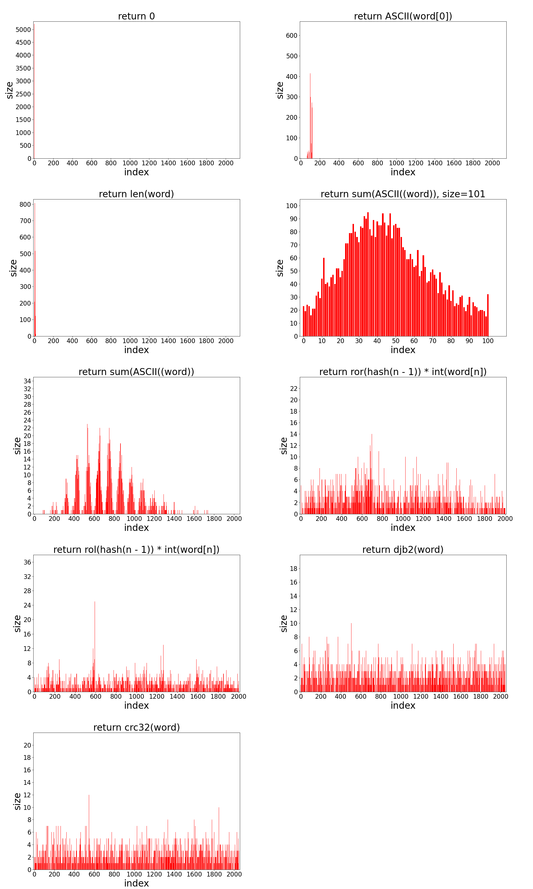
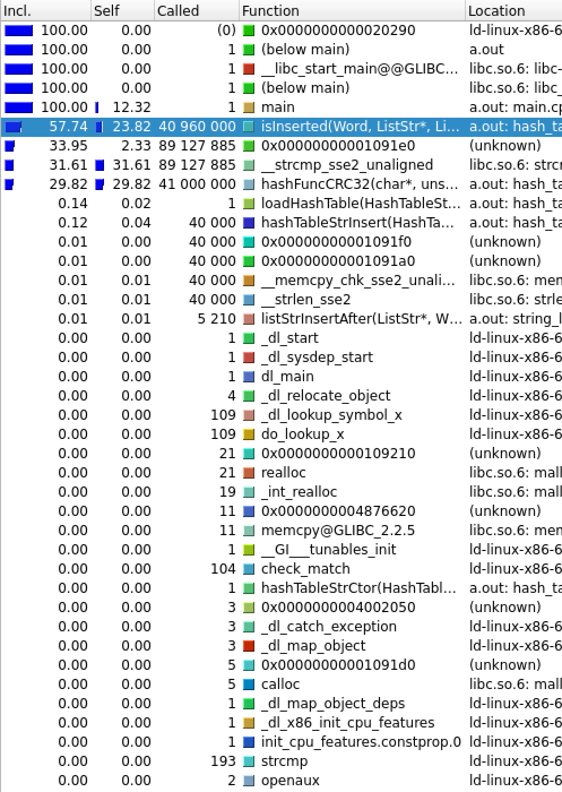
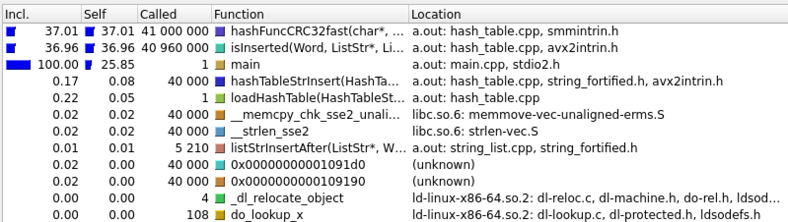

# Оптимизация хэш-таблиц при помощи низкоуровневого кода

## Задача

- Часть 1
    - написать хэш-таблицу для строк и несколько хэш-функций для неё
    - выяснить, какая хэш-функция дает лучшее распределение
- Часть 2
    - оптимизировать функции, которые больше всего влияют на время работы программы, использовать для этого три метода оптимизации
        - функции, написанные на ассемблере
        - ассемблерные вставки
        - SIMD инструкции
    - при оптимизации минимизировать использование ассемблерных инструкций и рассчитать КПД оптимизации по формуле: $\frac{коэффициент \ ускорения}{кол-во \ ассемблерных \ инструкций} * 1000$

## Ход работы

Реализована хэш-таблица на двусвязных списках, использующих три массива, общие для всех списков.

## Часть 1: Сравнение хэш-функций

<figure>

</figure>

### Исходники графиков
- [1. return 0](Images/charts/hash_func_1.png)
- [2. return int(word[0])](Images/charts/hash_func_2.png)
- [3. return  len(word)](Images/charts/hash_func_3.png)
- [4. return sum_ASCII(word) size=101](Images/charts/hash_func_4_101.png)
- [5. return sum_ASCII(word)](Images/charts/hash_func_4.png)
- [6. return ror(hash(n - 1)) * int(word[n])](Images/charts/hash_func_5.png)
- [7. return rol(hash(n - 1)) * int(word[n])](Images/charts/hash_func_6.png)
- [8. return djb2(word)](Images/charts/hash_func_7.png)
- [9. return crc32(word)](Images/charts/hash_func_8.png)

### Равномерность распределения

| Хэш-функция | Алгоритм | Дисперсия|
|:-----------:|:--------:|:---------:|
|   1   | return 0| 291 * 10<sup>2</sup>|
|   2   | return int(word[0])  |723|
|   3   | return  len(word) | 159 * 10|
|   4   | return sum_ASCII(word) | 20.7 |
|   5   | return ror(hash(n - 1)) * int(word[n])  | 3.4|
|   6   | return rol(hash(n - 1)) * int(word[n]) | 7.8|
|   7   | return djb2(word)  | 2.6 |
|   8   | return crc32(word) | 2.5 |

**Лучшее распределение оказалось у хэш-функции CRC32. В дальнейшем будем использовать ее. К тому же мы сможем оптимизировать её вычисление при помощи SIMD
инструкции.**

### Трансляция хэш-функций, использующих циклический сдвиг (5, 6)

Компилятор `x86-64 gcc 13.2` на сайте https://godbolt.org/ транслирует код следующим образом

*Исходный код*

```C
    return (num >> 8 * sizeof(size_t) - 1) | (num << 1)
```

 *Оптимизация -O0*

 ```assembly
    mov     rax, QWORD PTR [rbp-8]
    rol     rax
```

 *Оптимизация -O1*

 ```assembly
    rol     rax
```

**При любом уровне оптимизации компилятор использовал при трансляции ассемблерную команду циклического сдвига, но при уровне оптимизации -O0 данные пересылаются из памяти, а при более высоком уровне оптимизации используются только регистры, что эффективнее.**

> [!NOTE]
> Более старые компиляторы (например, `x86 msvc v19.14`) при низком уровне оптимизации не вставляют циклический сдвиг.

## Часть 2: Что оптимизировать?

Первая оптимизация - отключить отладку \
Вторая - использовать -O3


При помощи утилиты `callgrind` определим, какие функции больше всего влияют на время работы хэш-таблицы. (Результаты профилирования [здесь](callgrind))

> [!NOTE]
> Использование callgrind: `valgrind --tool=callgrind`

<figure>

</figure>

**Оказалось, что 37% времени занимает хэш-функция CRC32 и 25% strcmp. Будем оптимизировать...**

### Оптимизируем

1)  Все слова из нашего текста оказались не длиннее 31 символа, а значит каждое из них влезет в 256 бит. Будем использовать в качестве ключа хэш-таблицы `union`.

```C
union Word {
    char str[32];
    __m256i packed;
};
```

Теперь все слова выровнены и мы можем использовать для сравнения SIMD инструкцию `_mm256_cmpeq_epi8()`.

2) Для ускорения хэш-функции CRC32 будем использовать `_mm_crc32_u8()`.

### Результаты оптимизации

| Оптимизация | Время, c |Ускорение относительно -O0| Ускорение относительно -O3| Ускорение относительно предыдущей версии |
|:-:|:-:|:-:|:-:|:-:|
| -O0         |27.64| 1| 0.64 | - |
| -O3         |17.71|1.56 | 1 | 1.56 |
| -O3 + strcmp| 12.27 | 2.25 | 1.44 | 1.44 |
| -O3 + strcmp + crc32| 9.82 | 2.81 | 1.80 | 1.25 |

После оптимизации получим еще раз временной профиль программы.

<figure>

</figure>

**Вес не оптимизированных функций не больше 0.08% поэтому дальнейшие оптимизации этой хэш-таблицы нецелесообразны, потому что прирост производительности будет меньше 1%.**

Но одна из задач работы - использовать все три вида оптимизации, поэтому в учебных целях было проведены следующие попытки ускорения:
- хэш-функция `return sum(ASCII(word))` оптимизирована при помощи функции, написанной на ассемблере. Прирост производительности: 13.65 / 13.27 * 100% $\approx$ 103%
    <details>
    <summary>оптимизированная функция</summary>

    ```assembly
    hashFuncSumASCIIAsm:
        push rdx
        xor rax, rax
    .ascii_loop:
            cmp byte [rdi], 0x0
        je .end
        movsx rdx, byte [rdi]
        add rax, rdx
        inc rdi
        jmp .ascii_loop
    .end:
        and rax, 0x7FF
        pop rdx
        ret
    ```

    </details>
- хэш-функции `rol(hash(n - 1)) * int(word[n])` использована ассемблерная вставка. Прирост производительности: 11.76 / 11.10 * 100%  $\approx$ 106%
    <details>
    <summary>оптимизированная функция</summary>

    ```C
    size_t hashFuncRolAsm(char *str, size_t size) {

        assert(str);

        size_t hash = 0;
        __asm__ (
            ".intel_syntax noprefix\n\t"

            "mov rdi, %1\n\t"
            "mov rdx, %2\n"
            ".hash_loop:\n\t"
            "cmp byte ptr [rdi], 0x0\n\t"
            "je .end_loop\n\t"
            "mov rax, rdx\n\t"
            "rol rdx\n\t"
            "movsx rax, byte ptr [rdi]\n\t"
            "add rdx, rax\n\t"
            "inc rdi\n\t"
            "jmp .hash_loop\n"
            ".end_loop:\n\t"
            "and rdx, 0x7FF\n\t"
            "mov %0, rdx\n\t"

            ".att_syntax\n"

            :"=r"(hash)
            :"r"(str) ,"r"(hash)
            :"%rdx", "%rdi", "%rax"
        );

        return hash;
    }
    ```

    </details>

### КПД = $\frac{2.81}{3} * 1000 \approx 936,67$