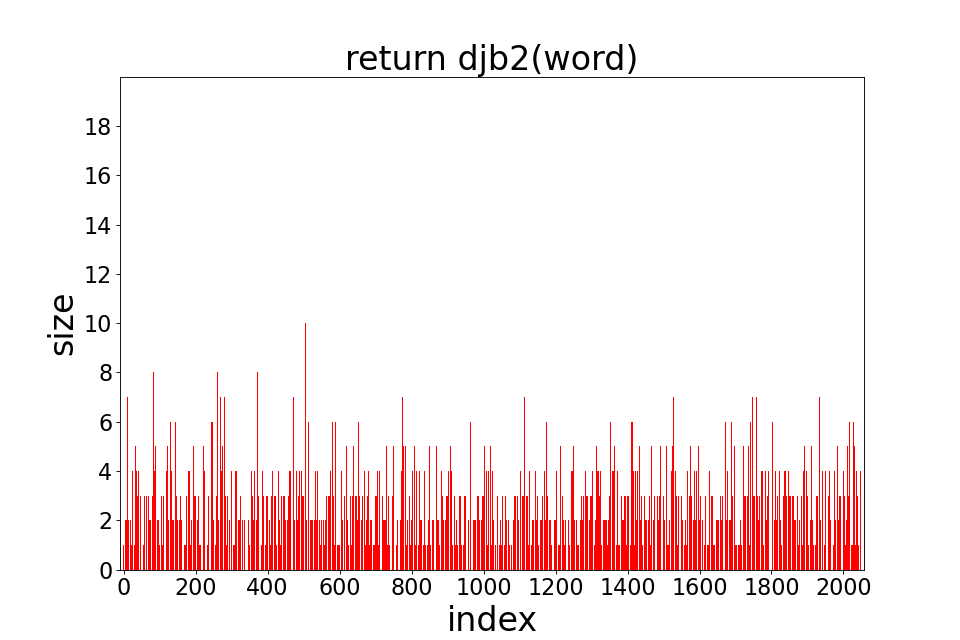

# Оптимизация хэш-таблиц при помощи SIMD инструкций и ассемблерного кода

## **Часть 1**

## Задача

- Написать хэш-таблицу для строк фиксированного размера и 6 заданных хэш-функций для неё и одну свою
- Преобразовать текст в набор слов без знаков пунктуации (кол-во слов не меньше 40 000)
- Поместить полученный набор слов в хэш-таблицу и построить диаграммы, отображающие длины цепочек в ячейках хэш-таблицы после вставки слов, для каждой хэш-функции
- выяснить, для какой хэш-функции количество коллизий наименьшее
- посмотреть, как транслируется код пятой и шестой хэш-функций

## Ход работы

Реализована хеш-таблица на двусвязном списке с использованием трех массивах, общих для всех списков. Размер таблицы - 2003
### Функции хэш-таблицы:
- вставка (если элемент уже есть есть в хэш-таблицы, повторная вставка не производится)

## Полученные результаты

### 1) Хэш-функция, всегда возвращающая 0

```C
size_t hashFuncZero(char *str, size_t size) {

    assert(str);

    return 0 % size;
}
```

<figure>

</figure>

**Все слова, как и ожидалось, попали в список под индексом 0.**

### 2) Хеш-функция, возвращающая ASCII код первого символа

```C
size_t hashFuncLetterASCII(char *str, size_t size) {

    assert(str);

    return (size_t) str[0] % size;
}
```

<figure>

</figure>

**Все слова находятся в диапазоне [0;255]**

### 3) Хэш-функция, возвращающая длину слова

```C
size_t hashFuncLength(char *str, size_t size) {

    assert(str);

    return strlen(str) % size;
}
```

<figure>

</figure>

**Большое количеств артиклей и коротких слов привело к большому числу коллизий**

### 4) Хеш-функция, возвращающая сумму ASCII кодов букв слова

```C
size_t hashFuncSumASCII(char *str, size_t size) {

    assert(str);

    size_t ascii_sum = 0;
    for (size_t i = 0; str[i] != '\0'; i++) {
        ascii_sum += (size_t) str[i];
    }

    return ascii_sum % size;
}
```

**Для таблицы размера 101**

<figure>

</figure>

**Для таблицы размера 2003**

<figure>

</figure>

**Распределение лучше, чем в предыдущих вариантах, но все равно не очень хорошее, особенно для таблицы размера 101**

### 5) Хеш-функция, которая делает циклический сдвиг вправо результата для подстроки размера на 1 меньше и применяет к нему xor с ASCII кодом текущего символа

```C
size_t hashFuncRor(char *str, size_t size) {

    assert(str);

    size_t hash = 0;
    for (size_t i = 0; str[i] != '\0'; i++) {
        hash = myRor(hash) ^ (size_t) str[i];
    }

    return hash % size;
}
```

<figure>

</figure>

**Эта хэш-функция довольно равномерно распределила элементы**

### 6) Хеш-функция, аналогичная предыдущей, но циклический сдвиг теперь производится влево

```C
size_t hashFuncRol(char *str, size_t size) {

    assert(str);

    size_t hash = 0;
    for (size_t i = 0; str[i] != '\0'; i++) {
        hash = myRol(hash) ^ (size_t) str[i];
    }

    return hash % size;
}
```

<figure>

</figure>

**На диаграмме видны несколько пиков, где коллизия велика, потому распределение немного хуже, чем в прошлом варианте, из-за отсутствия равномерности.**

### 7) Моя хэш-функция, которая считает хэш по алгоритму djb2

```C
size_t hashFuncDjb2(char *str, size_t size) {

    assert(str);

    size_t hash = 5381;

    for (size_t i = 0; str[i] != '\0'; i++) {
        hash = ((hash << 5) + hash) + (size_t) str[i];
    }

    return hash % size;
}
```

<figure>

</figure>

**Очень равномерное распределение, длина списков не превышает 12**

### Равномерность распределения

| Хэш-функция | Алгоритм | Дисперсия * 10<sup>2</sup>|
|:-----------:|:--------:|:---------:|
|   1   | return 0| 291.99|
|   2   | return int(word[0])  |7.23|
|   3   | return  len(word) |15.9|
|   4   | return sum_ASCII(word) | 0.2 |
|   5   | return ror(hash(n - 1)) * int(word[n])  | 0.04|
|   6   | return rol(hash(n - 1)) * int(word[n]) | 0.06|
|   7   | return djb2(word)  | 0.03|

### Вывод

Лучшее распределение оказалось у седьмой хэш-функции. Немного хуже результаты у пятой и шестой.

### Трансляция пятой и шестой хэш-функций

Компилятор `x86-64 gcc 13.2` на сайте https://godbolt.org/ транслирует код следующим образом

1)  **Используется sizeof(size_t)**

    *Исходный код:*
    ```C
        return (num >> sizeof(size_t) - 1) | (num << 1)
    ```

    **Оптимизация:** -O0

    *Полученный код:*

    ```assembly
        mov     rax, QWORD PTR [rbp-8]
        shr     rax, 7
        mov     rdx, rax
        mov     rax, QWORD PTR [rbp-8]
        add     rax, rax
        or      rax, rdx
    ```

    **Оптимизация:** -O1

    *Полученный код:*

    ```assembly
        mov     rdx, rax
        shr     rdx, 7
        add     rax, rax
        or      rdx, rax
    ```

    При оптимизации -O0 компилятор пересылает числа из памяти, что замедляет программу, а при оптимизации -O1 и выше используются только регистры

2)  **Используется прямая подстановка числа**

    *Исходный код:*
    ```C
        return (num >> 63) | (num << 1)
    ```

    **Оптимизация:** -O0

    *Полученный код:*

    ```assembly
        mov     rax, QWORD PTR [rbp-8]
        rol     rax
    ```
    **Оптимизация:** -O1

    *Полученный код:*

    ```assembly
    rol     rax
    ```
    При оптимизации -O0 компилятор пересылает число из памяти, а при оптимизации -O1 и выше используются только регистр, что ускоряет программу

**При использовании `sizeof(size_t)` компилятор использовал битовые сдвиги, а при прямой подстановке числа заменил мою функцию на ассемблерный циклический сдвиг, поэтому второй вариант оптимальнее. С пятой хэш-функцией ситуация аналогична.**

## **Часть 2**

## Задача

- при помощи профилирования определить время работы функций
- использую полученные данные найти два типа времени
    - работа функции с учетом времени работы вызываемых внутри функций
    - работа фукции без учета вызываемых  внутри функций
- использовать три вида оптимизации хэш-таблицы
    - SIMD инструкции
    - ассемблерные вставки
    - функции, целиком написанные на ассемблере
- оценить результаты оптимизации

##
