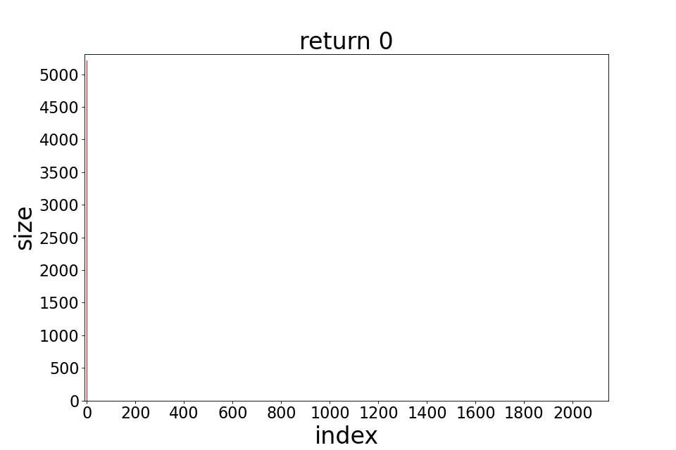

# Оптимизация хэш-таблиц при помощи ассемблерных инструкций

## Часть 1

## Задача

- Написать хэш-таблицу для строк фиксированного размера и 7 хэш-функций для неё:
    - хэш-функция, которая всегда возвращает 0
    - хэш-функция, которая возвращает ASCII код первого символа строки
    - хэш-функция, которая возвращает длину слова
    - хэш-функция, которая возвращает сумму ASCII кодов символом строки
    - хэш-функция, вычисляема рекурсивно
- Преобразовать текст в набор слов без знаков пунктуации (кол-во слов не меньше 40 000)
- Поместить полученный набор слов в хэш-таблицу и построить диаграммы, отображающие длины цепочек в ячейках хэш-таблицы после вставки слов, для каждой хэш-функции
- выяснить, для какой хэш-функции количество коллизий наименьшее

## Ход работы

Реализована хеш-таблица на двусвязном списке на трех массивах, общих для всех списков. Размер таблицы - 2003
### Функции хэш-таблицы:
- вставка (если элемент уже есть есть в хэш-таблицы, повторная вставка не производится)

## Полученные результаты

### 1) Хэш-функция, всегда возвращающая 0

```C
size_t hashFuncZero(char *str, size_t size) {

    assert(str);

    return 0 % size;
}
```

<figure>

</figure>

### 2) Хеш-функция, возвращающая ASCII код первого символа

```C
size_t hashFuncLetterASCII(char *str, size_t size) {

    assert(str);

    return (size_t) str[0] % size;
}
```

<figure>

</figure>

### 3) Хэш-функция, возвращающая длину слова

```C
size_t hashFuncLength(char *str, size_t size) {

    assert(str);

    return strlen(str) % size;
}
```

<figure>

</figure>

### 4) Хеш-функция, возвращающая сумму ASCII кодов букв слова

```C
size_t hashFuncSumASCII(char *str, size_t size) {

    assert(str);

    size_t ascii_sum = 0;
    for (size_t i = 0; str[i] != '\0'; i++) {
        ascii_sum += (size_t) str[i];
    }

    return ascii_sum % size;
}
```

**Для таблицы размера 101**

<figure>

</figure>

**Для таблицы размера 2003**

<figure>

</figure>

### 5) Хеш-функция, которая делает циклический сдвиг вправо результата для подстроки размера на 1 меньше и применяет к нему xor с ASCII кодом текущего символа

```C
size_t hashFuncCycleShiftRight(char *str, size_t size) {

    assert(str);

    size_t hash = 0;
    for (size_t i = 0; str[i] != '\0'; i++) {
        hash = myCycleShiftRight(hash) ^ (size_t) str[i];
    }

    return hash % size;
}
```

<figure>

</figure>

### 6) Хеш-функция, аналогичная предыдущей, но циклический сдвиг теперь производится влево

```C
size_t hashFuncCycleShiftLeft(char *str, size_t size) {

    assert(str);

    size_t hash = 0;
    for (size_t i = 0; str[i] != '\0'; i++) {
        hash = myCycleShiftLeft(hash) ^ (size_t) str[i];
    }

    return hash % size;
}
```

<figure>

</figure>

### 7) Хэш-функция, которая считает хэш по алгоритму djb2

```C
size_t hashFuncDjb2(char *str, size_t size) {

    assert(str);

    size_t hash = 5381;

    for (size_t i = 0; str[i] != '\0'; i++) {
        hash = ((hash << 5) + hash) + (size_t) str[i];
    }

    return hash % size;
}
```

<figure>

</figure>